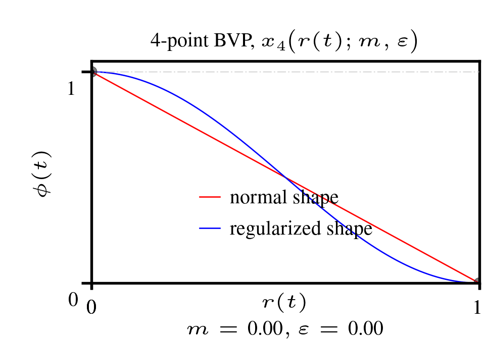
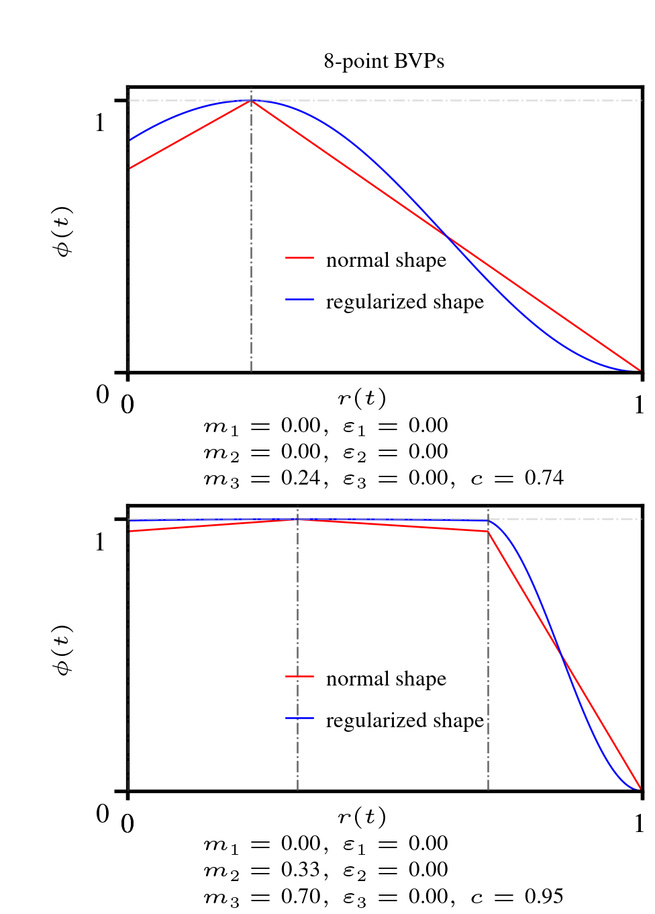
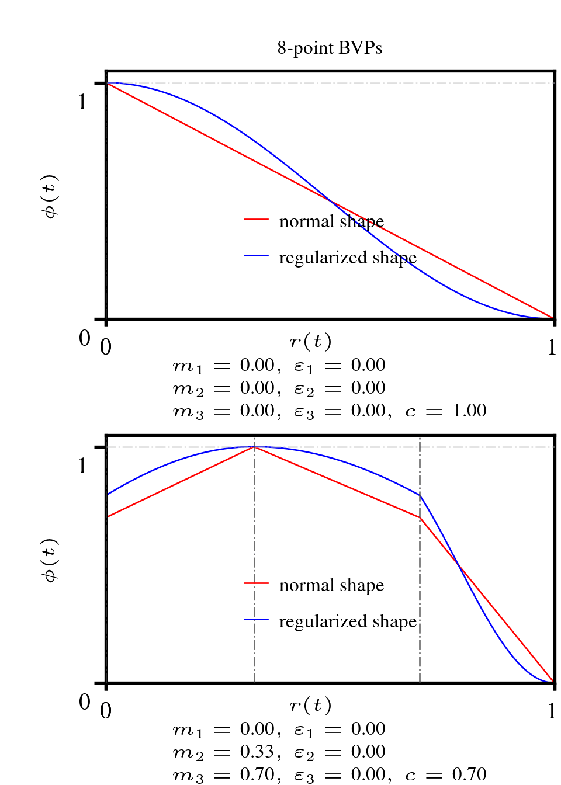

# bvp_lrs 

Boundary-value problem (BVP)-based learning-rate schedules for training neural networks.

`bvp_lrs` is a compact library for generating learning-rate schedules from boundary-value problem (BVP) profiles. Instead of hardcoding a single formula, you can shape the schedule using BVP families and tune parameters to express warmup, plateau or more complex multi-stage behavior in addition to decay behavior.

<p align="center">


## Overview

This repository provides implementation of a family of learning-rate schedules built from boundary-value problem (BVP) profiles. The schedule design follows a normalized training horizon `r in [0,1]`, where the profile captures the desired shape of the expected step-size magnitude over time, and a smooth variational window function (a linear window or its regularized version, the raised-cosine window) converts that profile into a practical learning-rate curve.

The code is available in both NumPy and PyTorch, making it suitable for research, prototyping, and optimizer experiments.

- Numpy: `bvp_lrs_np.py`
- PyTorch: `bvp_lrs_torch.py`

## Core Logic

Let `r` denote the normalized iteration index over the training horizon.

A BVP profile `x(r)` is constructed to encode a schedule shape such as:

- warmup,
- plateau,
- multi-stage or asymmetric phases of increase/decrease,

into the annealing operation. The final schedule is then generated by passing the profile into a window function:

- p-th root linear window: `glin(x, p=1) = (1 - x)^(1/p)`
- p-th root raised cosine window: `grcos(x, p=1) = cos(0.5 * pi * x)^(2/p)`

These windows are the smoothest over the normalized domain with respect to the first-order total variational energy functional of the expected step-size magnitude, and provide a template for optimizer step-size control.

## Repository structure

- `bvp_lrs_np.py` — NumPy implementations of all BVP families and windows
- `bvp_lrs_torch.py` — PyTorch equivalents for differentiable or optimizer-integrated use
- `bvp4lrs_anim.py` — animation of 4-point BVP schedules
- `bvp8lrs_anim.py` — animation of 8-point BVP schedules
- `figures/` — generated plots, GIFs, and examples

## BVP families

### 2-point and 3-point profiles

The simplest BVPs are:

- `x2(r)`
- `x3(r, m)`

### 4-point profiles

The 4-point profile is:

- `x4(r, m, e)`

This supports a transition between warmup and decay-like behavior with simple, interpretable parameters. It generalizes the 2-point and 3-point profiles.

### 8-point profiles

The more expressive families are:

- `x8M(r, m1, m2, m3, e1, e2, e3, c)`
- `x8Dome(r, m1, m2, m3, e1, e2, e3, c)`

These allow multi-stage training behavior, including M-shaped and Dome-like profiles that can model more complex schedule logic.

## Window functions

The library includes two primary window constructions based on minimizing a first-order total variational energy functional.

### Linear window

```python
from bvp_lrs_np import glin

schedule = glin(profile, p=1)
```

This is the normal shape based on minimizing a first-order total variational energy functional.

### Raised-cosine window

```python
from bvp_lrs_np import grcos

regularized = grcos(profile, p=1)
```

This is based on minimizing a regularized first-order total variational energy functional.

## Usage example

```python
import numpy as np
from bvp_lrs_np import x4, glin, grcos
# from bvp_lrs_torch import x4, glin, grcos

# normalized horizon of learning iterations
r = np.linspace(0.0, 1.0, 1000)

# 10% warmup, 20% constant
bvp_profile = x4(r, 0.1, 0.2)

# Dirichlet-energy minimizing window
schedule = glin(bvp_profile, p=1)

# Regularized Dirichlet-energy minimizing window
reg_schedule = grcos(bvp_profile, p=1)


```

## PyTorch integration

```python

import torch
from bvp_lrs_torch import x4, glin

# get the current normalized time-step
r_t = (step - 1) / num_iterations
# note: 'step - 1' converts Pytorch's optimizer class default one-based indexing to a zero-based version

# normalize the stochastic gradient 'grad' using its second moment estimate
smom = 0.999*smom + 0.001*(grad*grad)
grad_smom = smom/(1 - (0.999**step))
grad_smom = torch.sqrt(smom).add(1e-10)

# apply a schedule to the maximum step-size 'mu'
mu_t = mu * glin(x4(r_t, 0.05, 0), p=2)
lr_t = mu_t / grad_smom

# update the model parameter 'p' using 
# the learning-rate 'lr_t' and 'grad'
p = p - lr_t * grad

```

This pattern makes it straightforward to plug the schedule into optimizer steps while preserving a differentiable and parameterized design.


## Example: 8-point BVP profiles

```python
import numpy as np
from bvp_lrs_np import x8M, x8Dome, grcos
# from bvp_lrs_torch import x8M, x8Dome, grcos 

r = np.linspace(0.0, 1.0, 1000)

profile = x8M(r, 0.0, 0.0, 0.24, 0.0, 0.0, 0.0, 0.74)
schedule = glin(profile, p=1)


profile = x8Dome(r, 0.0, 0.33, 0.70, 0.0, 0.00, 0.00, 0.95)
schedule = glin(profile, p=1)
```

<p align="center">


## Visualization

The project includes animation scripts to inspect how the BVP families evolve with respect to their parameters:

```bash
python bvp4lrs_anim.py
python bvp8lrs_anim.py
```

These scripts help visualize the effect of parameter changes on profile shape and overall schedule behavior.

The animation below demonstrates the complicated shape construction capabilites of the `x8M` and `x8Dome` families.

<p align="center">


## Related work and citation

The project is based on a tust-region framework for constructing learning-rate schedules using BVP-driven profiles and smooth variational windows. The underlying methodology is described in the related preprint:

- https://somefunagba.github.io/assets/pdf/vantr_lrschedule.pdf


## Notes

This repository is intentionally compact and provides a principled and extensible set of schedule-building primitives that can be adapted to optimizer design and experimentation.

