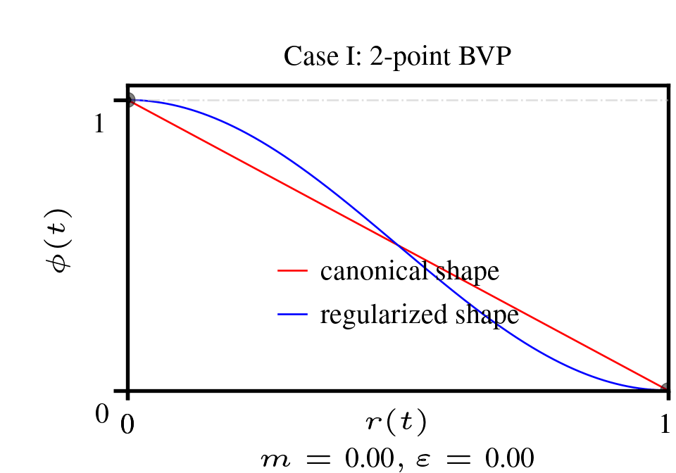
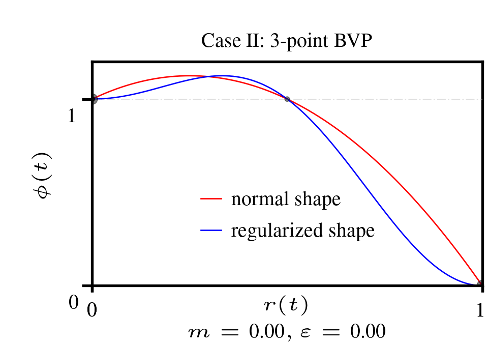
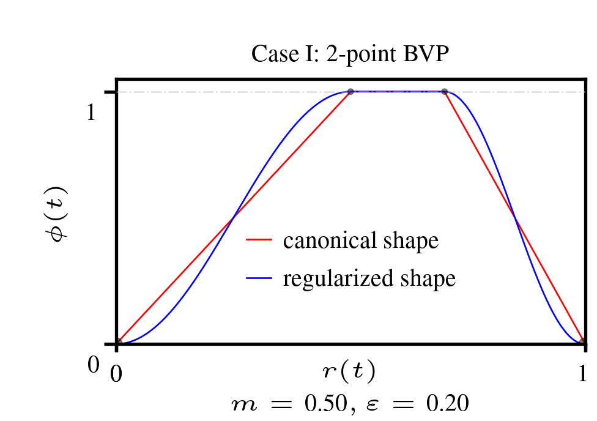
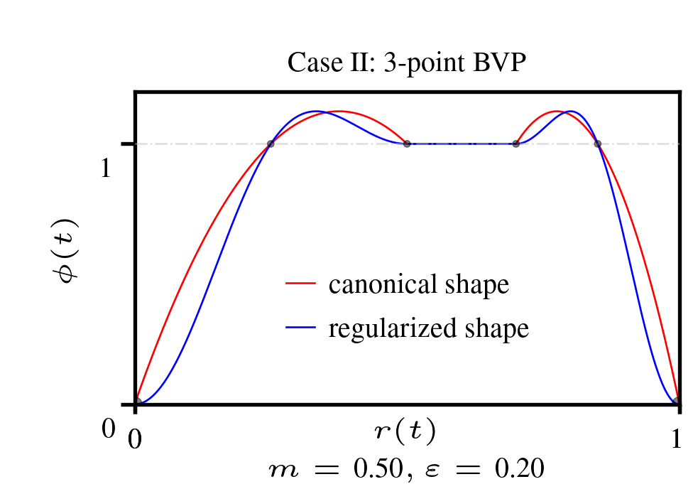

# bvp_lrs

Boundary-value problem (BVP) derived learning-rate schedules (LRS) for deep learning.

`bvp_lrs` is a compact library for generating learning-rate schedules from a boundary-value problem (BVP) profile. Instead of relying on fixed heuristic formulas, a BVP profile encodes warmup, plateau, multi‑stage, and decay behavior. Smooth variational window functions transform these profiles into practical schedules suitable for modern optimizers.

<p align="center">


## Overview

The library offers a compact, extensible set of schedule-building primitives

- A normalized BVP profile captures the desired shape of the expected step-size magnitude over the training horizon.
- A smooth variational window function or its regularized version converts that profile into a practical expected step-size trajectory for the learning-rate.
- The trajectories decay to zero at the end of the learning horizon, but can be configured to a fraction of the initial step-size.

The code is available in both NumPy and PyTorch, making it suitable for research, prototyping, and optimizer integration.

### Files

- `bvp_lrs_np.py` — NumPy implementation of a BVP profile and window functions
- `bvp_lrs_torch.py` — PyTorch equivalent for optimizer-integrated use
- `case1_anim.py` — Animation of 2-point BVP schedules
- `case2_anim.py` — Animation of 3-point BVP schedules
- `figures/` — Generated plots and GIFs

## Core Implementation Logic

Assume you have defined

- `mu` as your initial step-size guess or estimate, and
- `r in [0,1]` as the normalized iteration index over a finite training horizon.

### BVP profile

A BVP profile `x(r)` is constructed to encode the schedule shape of the annealing operation. 

Profiles are generated using:

- `x = bvp_prof(r, m=0, e=0)`

with two interpretable knobs:

- m to specify a warmup fraction (rise-time)
- e to specify a constant-hold (plateau) fraction

This supports a transitions across warmup, overshoot, plateau and decay-like phases to enable multi-stage training behavior.

## Window functions

A schedule decaying to 0 is then generated by passing the profile into a normalized window function `y(x(r))`.

Optionally, if the user decides to not decay to 0. The schedule is then passed into `endpt(y(x(r)), l)` so that it  decays to a `l in [0,1)` fraction of the initial step-size estimate `mu`.

Two cases are provided based on variational energy minimization. 


### Case 1

*Goal*: Minimize the total first-order variational energy functional of the expected step-size magnitude subject to boundary value constraints.

#### p-th root Linear window

`case1_lin(x, p) = (1 - x) ^ (1/p)`

```python
from bvp_lrs_np import case1_lin, bvp_prof, endpt

schedule = endpt(case1_lin(bvp_prof(r)))
```

This is the canonical window shape obtained. Also root `p = 1` by default.

#### p-th root Raised-cosine window

`case1_rcos(x, p) = cx ^ (1/p)`, 

where `cx = cos(0.5 * pi * x)^2 = 0.5(1 + cos(pi * x))`

```python
from bvp_lrs_np import case1_rcos, bvp_prof, endpt

schedule = endpt(case1_rcos(bvp_prof(r)))
```

This is the regularized version derived by minimizing a Tikhonov regularized total first-order variational energy functional of the expected step-size magnitude.


*Remarks*: These windows are the smoothest over the normalized domain with respect to the total first-order variational energy functional of the expected step-size magnitude, and provide a template for optimizer step-size control and derivation of existing popular schedules

### Case 2

*Goal*: Maximize the Total expected step-size magnitude functional, while minimizing the Total first-order variational energy functional subject to boundary value constraints.

<p align="center">


#### p-th root Quadratic Polynomial window

`case2_lin(x, p) = ((1 + 2 x) (1 - x)) ^ (1/p)`

```python
from bvp_lrs_np import case2_lin, bvp_prof, endpt

schedule = endpt(case2_lin(bvp_prof(r)))
```

This is the canonical window shape obtained.

#### p-th root Sum of Raised-cosines window


`case2_rcos(x, p) = ((3 - 2 cx) cx) ^ (1/p)`

```python
from bvp_lrs_np import case2_rcos, bvp_prof, endpt

schedule =  endpt(case2_rcos(bvp_prof(r)))
```

Similarly, this window shape is derived by adding Tikhonov regularization to the energy functional.


*Remarks*: These novel windows additionally maximize the total expected step-size magnitude while remaining smooth over the normalized domain with respect to the total first-order variational energy functional of the expected step-size magnitude.


## Usage example

```python
import numpy as np

from bvp_lrs_np import bvp_prof, case1_lin, case1_rcos

# initial or max. step size
mu = 1e-4

# normalized iteration index
r = curr_iteration / total_iterations

# 10% warmup, 20% constant
bvp_profile = bvp_prof(r, m=0.1, e=0.2)

# canonical window
schedule = case1_lin(bvp_profile, p=1)

# regularized form of the canonical window
# schedule = case1_rcos(bvp_profile, p=1)

# transform the terminal decay value from 0 to 10% of mu
schedule = mu * endpt(schedule, l=0.1)


```


## PyTorch integration

The BVP learning-rate schedule can be plugged directly into an optimizer step.

```python

import torch
import bvp_lrs_torch as lrs

...

'''RMSProp'''
@torch.no_grad()
def step(self):
    for group in self.param_groups:
        group["step"] += 1
        t = group["step"]
        T = group["num_iterations"]

        # [zero-start indexed] normalized training time step
        r_t = (t - 1) / (T - 1)

        # BVP profile
        x = lrs.bvp_prof(r_t, m=group["warmup"], e=group["hold"])

        # Window function
        schedule = lrs.case1_lin(prof, p=group["root"])

        # Scheduled step-size
        mu_t = group["mu"] * lrs.endpt(schedule, l=group['end'])

        for p in group["params"]:
            if p.grad is None:
                continue

            grad = p.grad

            # Second-moment estimate
            group["smom"] = 0.999 * group["smom"] + 0.001 * (grad * grad)
            denom = torch.sqrt(group["smom"]).add(group["eps"])

            # learning-rate 'lr_t'
            lr_t = mu_t / denom

            # update the model parameter 'p'
            p.add_( -lr_t * grad )

...
```

## PyTorch Optimizer Wrapper

In most situations, we don't want to reimplement optimizers but just apply and test schedules. An example wrapper for a PyTorch Optimizer class is

```python
import torch
from torch.optim import Optimizer
import bvp_lrs_torch as lrs


class BVP_LRS:
    """
    Optimizer wrapper: modifies the step-size of a PyTorch optimizer
    using BVP-derived schedules from bvp_lrs_torch, 
    without re-implementing the optimizer logic. 
    
    Note: Must be called before optimizer.step().
    """
    def __init__(
        self,
        optimizer: Optimizer,
        window: str = "case1_lin",
        num_iterations: int,
        warmup: float = 0,
        hold: float = 0,
        decayto: float = 0,
        p: int = 1,
    ):
        self.optimizer = optimizer
        self.tau = num_iterations - 1
        self.m = warmup
        self.e = hold
        self.l = decayto
        self.scf = getattr(lrs, window)
        self.p = p
        self.t = 0


        for group in self.optimizer.param_groups:
            group.setdefault("mu", group["lr"])

    def step(self):
        """
        MUST be called before optimizer.step()
        """

        x = lrs.bvp_prof(t/self.tau, m=self.m, e=self.e)
        schedule = lrs.endpt(self.scf(x, p=self.p), l=self.l)
        self.t += 1

        for group in self.optimizer.param_groups:
            group["lr"] = group["mu"] * schedule


```

### Usage Examples

```python
optimizer = torch.optim.RSMprop(model.parameters(), lr=1e-3)

# 10% warmup, 0% hold, square-root linear decay to zero over 50 million iterations
scheduler = BVP_LRS(
    optimizer,
    num_iterations=50000000,
    warmup=0.1,
    p=2,
)

for batch in loader:
    loss = model(batch)
    loss.backward()

    # step
    scheduler.step() # BVP schedule update
    optimizer.step() # Optimizer logic

    optimizer.zero_grad()

```

```python
optimizer = torch.optim.RSMprop(model.parameters(), lr=1e-3)

# 0% warmup, 20% hold, cosine annealing to 10% of initial step-size over 50 million iterations
scheduler = BVP_LRS(
    optimizer,
    window='case1_rcos',
    num_iterations=50000000,
    hold=0.2,
    decayto=0.1
)

for batch in loader:
    loss = model(batch)
    loss.backward()

    # step
    scheduler.step() # BVP schedule update
    optimizer.step() # Optimizer logic

    optimizer.zero_grad()

```

```python
optimizer = torch.optim.RSMprop(model.parameters(), lr=1e-3)

# 0% warmup, 0% hold, sum of raised-cosines decay to zero over 50 million iterations
scheduler = BVP_LRS(
    optimizer,
    window='case2_rcos',
    num_iterations=50000000,
)

for batch in loader:
    loss = model(batch)
    loss.backward()

    # step
    scheduler.step() # BVP schedule update
    optimizer.step() # Optimizer logic

    optimizer.zero_grad()

```

```python
optimizer = torch.optim.RSMprop(model.parameters(), lr=1e-3)

# 5% warmup, quad. polynomial decay to zero over 50 million iterations
scheduler = BVP_LRS(
    optimizer,
    window='case2_lin',
    num_iterations=50000000,
    warmup=0.05,

)

for batch in loader:
    loss = model(batch)
    loss.backward()

    # step
    scheduler.step() # BVP schedule update
    optimizer.step() # Optimizer logic

    optimizer.zero_grad()

```

The examples above show several ways to integrate `bvp_lrs` with a PyTorch Optimizer class.

## Visualization

The repository also includes animation scripts to inspect how the BVPs evolve with respect to their window parameters:

```bash
python case1_anim.py
python case2_anim.py
```

These scripts help visualize profile shape and overall schedule behavior.

<p align="center">


<p align="center">


## Related work and citation

This code is based on a trust-region framework for constructing learning-rate schedules using smooth variational windows. The underlying methodology is described in the related preprint:

<a href="https://somefunagba.github.io/assets/pdf/vantr_lrschedule.pdf" target="_blank">A Variational Trust-Region Framework
for Learning-Rate Annealing</a>

> [!NOTE]
> The paper shows that popular, widely-used learning‑rate schedules in deep learning arise as **boundary-value constrained trust‑region trajectories** of the expected step-size magnitude, with shapes determined by a **total first‑order variational energy principle**.

From first-principles, one can then derive

- [x] Linear decay
- [x] Square‑root linear decay
- [x] Cosine annealing (second-order raised cosine)
- [x] Cosine annealing (first-order raised cosine)

as solutions to a 2-point BVP (Case 1). Extending this to multi-point BVPs yield

- [x] Warmup‑decay
- [x] Warmup‑stable‑decay

as natural consequences of the same underlying variational framework.

Case 2 then goes beyond deriving existing popular schedules in the literature.

## Notes

This repository is compact and provides an extensible set of schedule-building primitives that can be adapted to optimizer design and experimentation.
Please, cite when used.
